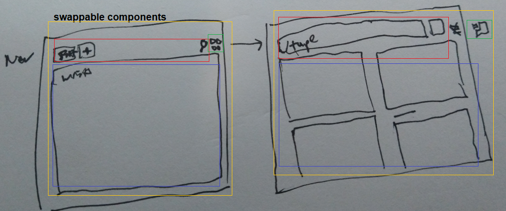
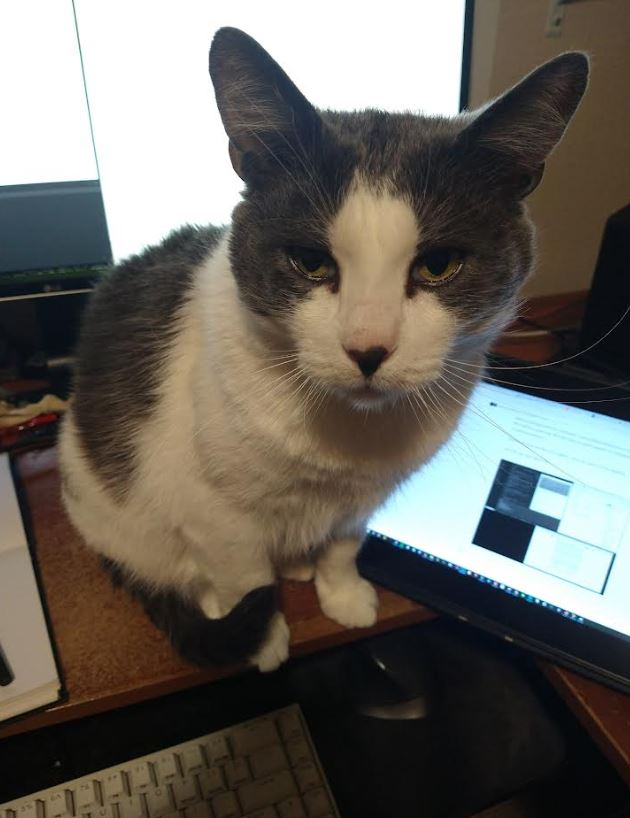
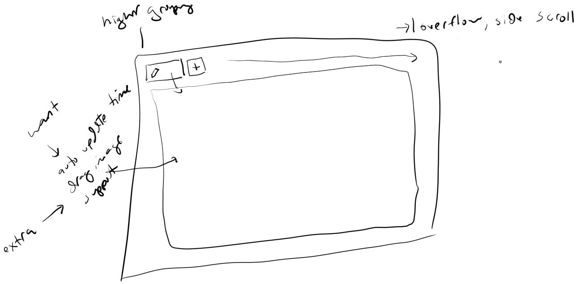
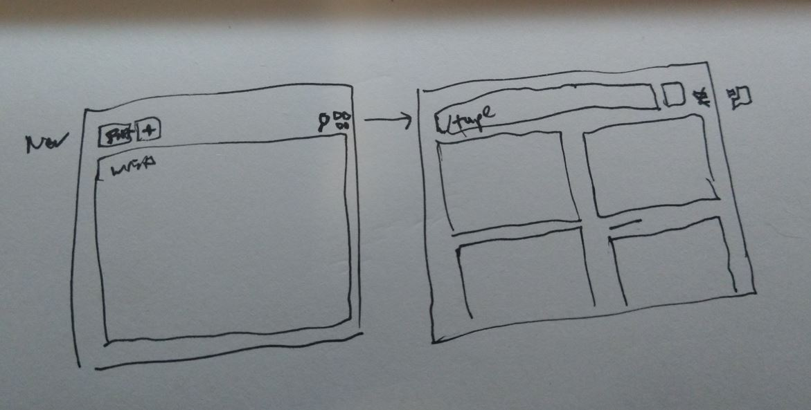

#### 12/03/2023

3:38 PM

Alright... man has sleep, time to write code for myself

This is a mental collection tool not for money (make something towards making money)

3:47 PM

There is this "it's so much work" wall to overcome but I need to get into the zone again.

Here are the parts to be made broken down

I was thinking about it, I think I'll have a `localStorage` entry for the tabs, then they have a map to the `tab => content` this way I can use that first set as a tab array and then find the data to load per active tab.

Oh yeah will need an `x` to close a tab

No way to delete, guess inside the body top right `delete` option... sucks unused space, trash icon maybe

Ahh... this UI doesn't make sense though, even if you have the grid view would be nice to have tabs still to pick which ones are shown.

Don't really want a search modal.

I have note taking apps already, issue is they are not multi-view/easy to switch like a tabbed interface.

3:58 PM

then the search will prioritize the tab names, then body content

I think I'll just use a back arrow when in search mode to go back to tab view but the single view vs. grid will be a separate icon as shown in drawing.

Single is actually a vertical stack, that can be nice for more space and should be collapsible.

Alright now to write up the stuff to build.

4:16 PM

alright I'm distracted time to start working

I have a cat in the way though

4:24 PM

Alright... NOS time and time to bust this out (focus loop music)

Oh wait, I forgot the requirements/specs

- [ ] remove starter code, css reset
- [ ] app -> header, body
- [ ] build out components
- [ ] add `localStorage` db
- [ ] add search
- [ ] maybe add auto timestamp
- [ ] maybe add photo support (means using contentEditable)

That's just a rough plan, not exact

4:42 PM

let's go baby he's in the zone autozone

I've been grabbing icons mostly

#### 11/30/2023

10:55 AM

I am excited at the thought of writing my own code again.

I've been mentally blocked for a while now. Right now I'm still tired/not sleeping well so I'm not as good as I can be.

You can see the design above. Pretty much you have a starting main text body area, then if you want more add tabs...

I'm still playing around with the interface.

This is a way to categorize my thoughts right now.

I would like image support, but that adds some complexity where you have to do:
- drag-drop
- base64 (larger storage)
- contentEditable (can break it)

Still with a contentEditable approach you can make something pretty cool

Oh yeah... there is another feature I want which I've added to another note app a long time ago.

It's an automatic time update stamp thing... every 5 minutes it will update a current/next line's time until you start writing.

That way I can see progression over time of when a line of text was added.

Back to analog lol, no remarkable/surface book

