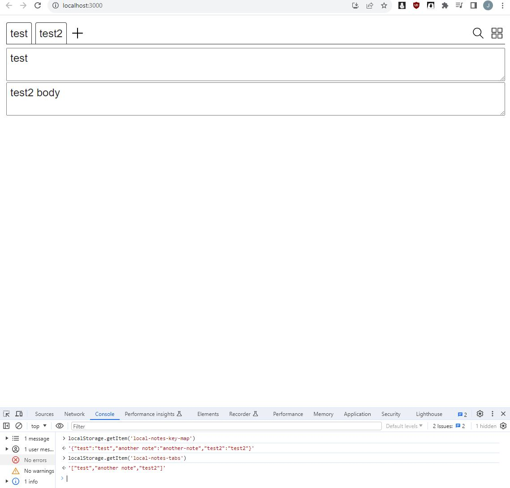
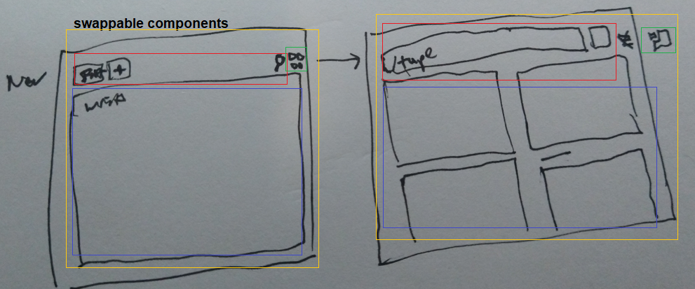
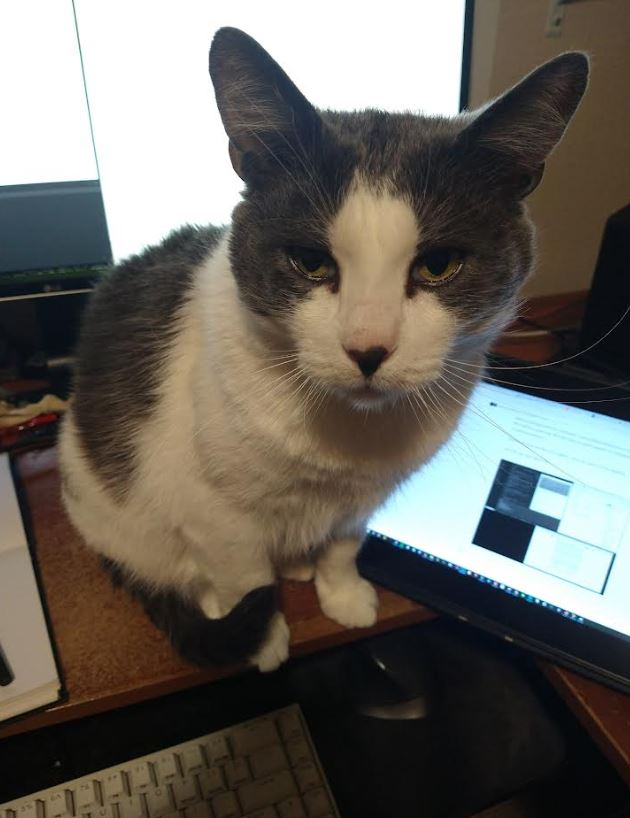
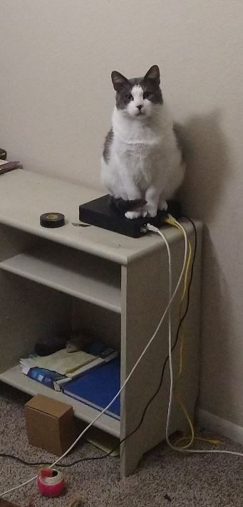
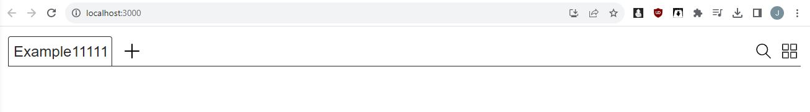
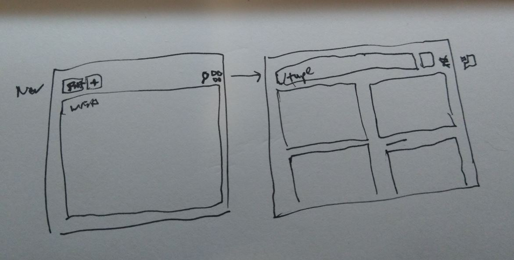

#### 12/05/2023

3:35 PM

damn, I'm sleeping way too much, it's like fantasy land to sleep

4:38 PM

quick break

alright let's start putting down some time

- [ ] add note

4:47 PM

ahhh, I have 4 hours to get this done

I gotta stop sleeping 12hrs+ a day, let's go focus mode

4:53 PM

I need this thing to keep track of all the stuff I gotta remember

5:39 PM

I'm probably not going to add the full feature set here, because it's not going to help me long term with my other things I need to do before I start working at the warehouse.

I'll add the basic crud functionality

Maybe I'll do tabbed vs. tiled as the two modes

5:55 PM

alright, starting to have something that works now

this works right here but no delete, no grid view

5:59 PM

I guess I'll go with the original design and show the active tab body... the bodies don't have a way to know which goes with what tab anyway.

6:13 PM

Okay... I think main other feature I want is to switch between tab and grid view

yeah already I'm like "should have built it this way" but don't know ahead of time

- [x] grid view
- [ ] delete note

ehh... I'm just in this state of mind like this app doesn't matter, it's useful to me but I need to stop working on it and do something else

6:32 PM

distracted

6:39 PM

added delete

#### 12/03/2023

3:38 PM

Alright... man has sleep, time to write code for myself

This is a mental collection tool not for money (make something towards making money)

3:47 PM

There is this "it's so much work" wall to overcome but I need to get into the zone again.

Here are the parts to be made broken down

I was thinking about it, I think I'll have a `localStorage` entry for the tabs, then they have a map to the `tab => content` this way I can use that first set as a tab array and then find the data to load per active tab.

Oh yeah will need an `x` to close a tab

No way to delete, guess inside the body top right `delete` option... sucks unused space, trash icon maybe

Ahh... this UI doesn't make sense though, even if you have the grid view would be nice to have tabs still to pick which ones are shown.

Don't really want a search modal.

I have note taking apps already, issue is they are not multi-view/easy to switch like a tabbed interface.

3:58 PM

then the search will prioritize the tab names, then body content

I think I'll just use a back arrow when in search mode to go back to tab view but the single view vs. grid will be a separate icon as shown in drawing.

Single is actually a vertical stack, that can be nice for more space and should be collapsible.

Alright now to write up the stuff to build.

4:16 PM

alright I'm distracted time to start working

I have a cat in the way though

4:24 PM

Alright... NOS time and time to bust this out (focus loop music)

Oh wait, I forgot the requirements/specs

- [x] remove starter code, css reset
- [x] app -> header, body
- [x] build out components
- [ ] build out and style base layout
- [ ] add `localStorage` db
- [ ] add search
- [ ] maybe add auto timestamp
- [ ] maybe add photo support (means using contentEditable)

That's just a rough plan, not exact

4:42 PM

let's go baby he's in the zone autozone

I've been grabbing icons mostly

4:57 PM

my fingers feel gross damn, on this keyboard, keep having to wash them

it's so funny my cat likes to sit on the router

5:10 PM

ahhhhhhh it's so much work, it's not hard but it's work

5:18 PM

switched to a loopable Korn song Beg for Me let's gooo

5:42 PM

man it's ugly...

I did add some more complicated stuff, the `Tab` component for example

5:48 PM

right now I'm just making the UI parts, then I'll add the storage/logic to make it actually work

5:53 PM

hmm... tab view and vertical doesn't make sense... I still do want to see multiple notes at the same time though/collapsible.

No way to collapse without adding a top bar... or build it into the UI/overlay like delete

5:58 PM

in the back of my mind I'm like "This is a waste of time"

but I will use it, to take notes

maybe a modal note add is inevitable, not a big deal

6:03 pM

might be dumb but an epoch timestamp is an easy unique id

6:08 PM

I'm losing momentum damn...

I'll just append active note bodies in vertical view/flow in grid view

Kind of odd like no point in having tabs if they're all visible, I guess you could jump/scroll to it or highlight it briefly

6:14 PM

I need data... have to do the data storage/retrieval I've just lost steam damn

6:17 PM

see the goal... want to have sets of notes

taking a brief break, need to get this done today since I have other things to make/do before I start working at amazon warehouse lmao (prophecy fulfilled)

6:37 PM

can of tuna and mayo

7:31 PM

still watching tv, going down the dark path

8:07 PM

still chilling, I may be done for today, wrap it up tomorrow

---

#### 11/30/2023

10:55 AM

I am excited at the thought of writing my own code again.

I've been mentally blocked for a while now. Right now I'm still tired/not sleeping well so I'm not as good as I can be.

You can see the design above. Pretty much you have a starting main text body area, then if you want more add tabs...

I'm still playing around with the interface.

This is a way to categorize my thoughts right now.

I would like image support, but that adds some complexity where you have to do:
- drag-drop
- base64 (larger storage)
- contentEditable (can break it)

Still with a contentEditable approach you can make something pretty cool

Oh yeah... there is another feature I want which I've added to another note app a long time ago.

It's an automatic time update stamp thing... every 5 minutes it will update a current/next line's time until you start writing.

That way I can see progression over time of when a line of text was added.

Back to analog lol, no remarkable/surface book

